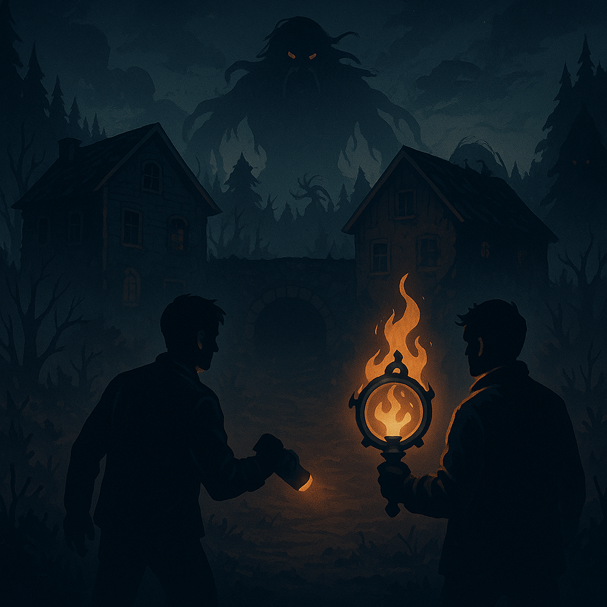

# Locked With Me

A **local co-op horror game for Android** built in Unity with C#.  
Playable in **singleplayer** or **local co-op**, the game challenges players to escape a locked house, survive AI enemies and ultimately destroy the dam trapping them on an island.

---

## Overview

Originally a small university assignment, I expanded it into a fully playable mobile game.  
**Problem:** Delivering AI, networking and atmosphere on limited Android hardware.  
**Method:** Implemented dynamic AI (sound/sight states), Mirror Networking for local co-op and mobile-focused optimizations (LOD, occlusion culling, progressive world loading).  
**Outcome:** A polished 10–15 minute horror game that runs smoothly on Android devices.

---

## Technical Contributions

- **AI & Gameplay Systems**
  - Enemy AI with sound and sight detection, dynamic searching and stealth mechanics.
  - Multiplayer-synced boss fight mechanics and player inventory system.

- **Networking**
  - Local co-op using **Mirror Networking**, including player sync, interaction and game state management.

- **Performance Optimization**
  - Unity URP, LODs and occlusion culling for mobile performance.
  - Progressive terrain loading.
  - Light probes & baked lightmaps for efficient indoor lighting.

- **Content Creation**
  - I personally modeled the **main house** in Blender.
  - Integrated free audio/visual effects with adaptive soundscapes (rain, waves, swamp wildlife, dynamic music).

---

## Code Structure

Core scripts in [`Scripts`](Scripts):

- **UIManager.cs** – Menus, network discovery, interaction system
- **PlayerMovement.cs** – Player controller, animations, inventory, multiplayer sync
- **NPCScript.cs** – AI pathfinding, perception (sound/sight), state management
- **GameManager.cs** – Game state, player tracking, victory conditions

---

## ▶ Game

**[Play on Itch.io](https://yourgame.itch.io/locked-with-me)**

---

## Media

---

## Connect

**LinkedIn:** [Rafael Faustino](https://www.linkedin.com/in/rgtdfaustino)
